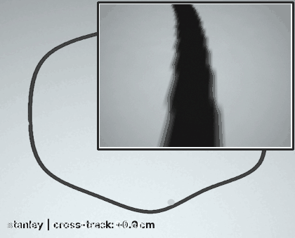
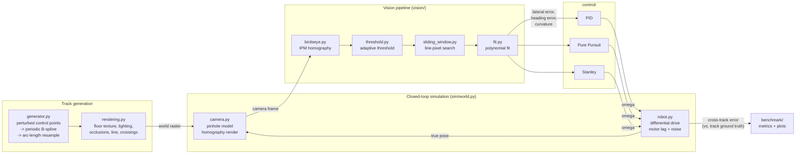
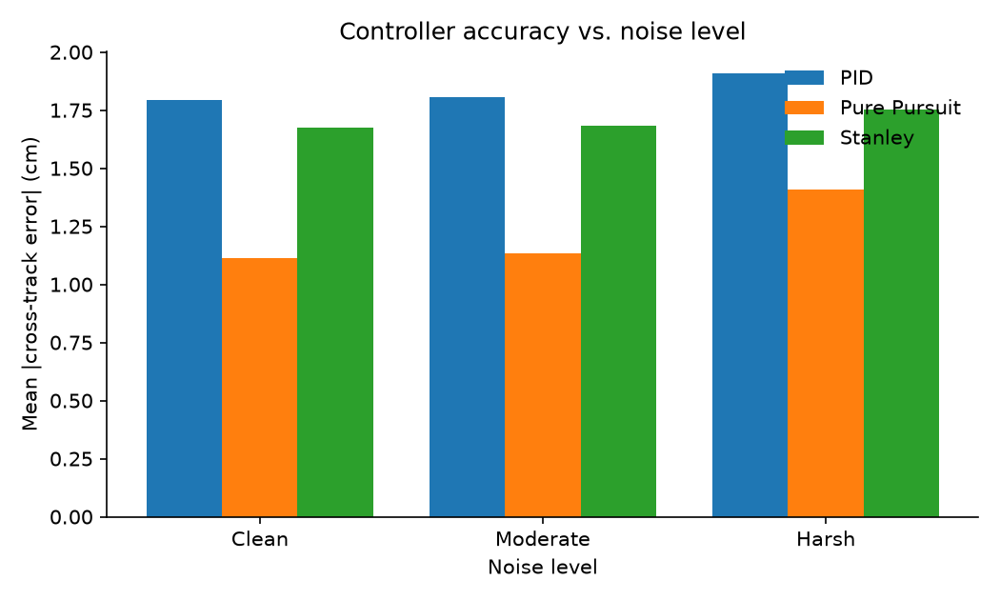
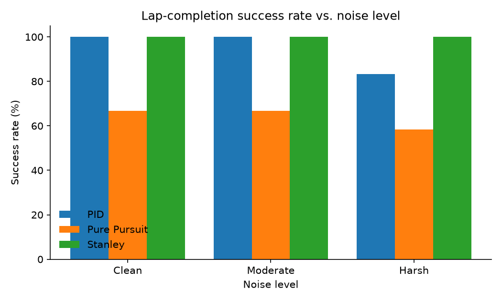
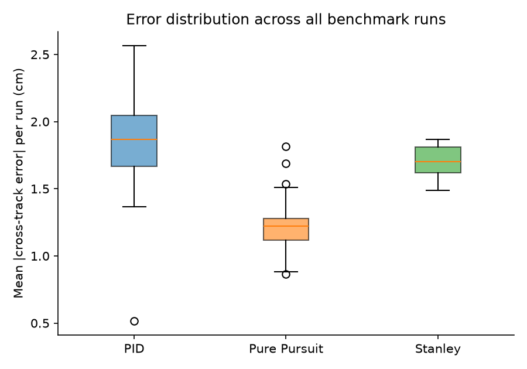

# Vision Line Follower

[](https://github.com/julians-eng/vision-line-follower-sim/actions/workflows/ci.yml)
[](LICENSE)
[](pyproject.toml)

A simulated differential-drive robot that follows a painted line using a
**classical computer-vision pipeline** (OpenCV) -- no hardware, no deep
learning. Procedurally generated tracks, a physically-motivated pinhole
camera model, a bird's-eye/adaptive-threshold/sliding-window/polynomial-fit
vision pipeline, and three steering controllers (PID, Pure Pursuit, Stanley)
compared head-to-head on a reproducible benchmark.

Lee esto en español: [README.es.md](README.es.md) · Theory, design
rationale and interview Q&A (in Spanish): [docs/LEARNING.md](docs/LEARNING.md)

<p align="center">
  
</p>

## Table of contents

- [Why this project](#why-this-project)
- [Architecture](#architecture)
- [Quickstart](#quickstart)
- [Usage](#usage)
- [The vision pipeline](#the-vision-pipeline)
- [The three controllers](#the-three-controllers)
- [Benchmark results](#benchmark-results)
- [Project structure](#project-structure)
- [Testing & CI](#testing--ci)
- [Known limitations & future work](#known-limitations--future-work)
- [License](#license)

## Why this project

Real line-follower robots are cheap to build but slow and fiddly to iterate
on: every controller-gain change means a battery cycle and a stopwatch. This
project simulates the entire stack -- track, camera, vision pipeline, robot
dynamics -- so that computer-vision and control-systems engineering can be
iterated on and benchmarked with the same rigor as any other software
system: reproducible seeds, automated tests on synthetic imagery, and a
quantitative comparison across controllers, tracks and noise levels instead
of "it looked fine on the bench."

## Architecture



Every frame: the camera renders what the robot sees from its true pose, the
vision pipeline turns that frame into `(lateral_error, heading_error,
curvature)`, an EMA filter smooths it, a curvature-scheduled target speed is
picked, the active controller turns those three numbers into an angular
velocity, and the robot's motor/kinematic model integrates the new pose.
Cross-track error for benchmarking is measured against the track's own
ground-truth centerline, **not** the vision system's self-reported error.

## Quickstart

```bash
python3 -m venv .venv && source .venv/bin/activate
pip install -e ".[dev]"

# Run one closed-loop simulation and print a summary
python scripts/run_demo.py --track oval --controller pid

# Run the full benchmark (all tracks x controllers x noise levels)
python scripts/run_benchmark.py

# Export an annotated GIF of one run
python scripts/make_gif.py --track curvy_loop --controller stanley

# Tests, lint, types
pytest
ruff check .
ruff format --check .
mypy src
```

Requires Python 3.11+. Dependencies: NumPy, OpenCV (headless), SciPy,
Matplotlib, imageio -- see `pyproject.toml`.

## Usage

| Script | What it does |
| --- | --- |
| `scripts/run_demo.py` | Runs one closed-loop simulation (`--track`, `--controller`, `--seed`) and prints a metrics summary. |
| `scripts/run_benchmark.py` | Runs the full sweep (3 tracks x 3 controllers x 3 noise levels x N seeds), writes `docs/benchmark_results.csv`, `docs/benchmark_summary.csv` and the comparison figures in `docs/img/`. |
| `scripts/make_gif.py` | Runs one simulation and exports an annotated GIF (top-down trajectory + camera inset) to `docs/img/`. |

The library itself is importable as `vision_line_follower` (src layout); see
the package docstrings (`vision_line_follower/__init__.py` and each
subpackage) for the public API.

## The vision pipeline

1. **Bird's-eye warp (IPM)** -- the forward camera view is perspective-warped
   into a top-down patch of the ground ahead of the robot, using a homography
   derived analytically from the camera's own intrinsic/extrinsic
   calibration (not fitted from point correspondences).
2. **Adaptive threshold** -- `cv2.adaptiveThreshold` isolates line pixels
   robustly under the lighting gradients and vignetting the renderer injects.
3. **Sliding-window search** -- starting from a histogram peak near the
   robot, stacked windows walk forward, recentring on detected pixels; an
   optional prior-position hint keeps the tracker anchored to the correct
   branch of the line through an X-crossing.
4. **Polynomial fit** -- a quadratic `lateral = f(forward)` fit yields lateral
   error, heading error (`atan` of the local slope) and curvature
   (`f'' / (1 + f'^2)^1.5`) in one shot.

See [docs/LEARNING.md](docs/LEARNING.md) for the full derivation of the
camera homography and the vision pipeline's math.

## The three controllers

All three consume the *same* three scalars from the vision pipeline and share
a curvature-scheduled speed profile, so the benchmark isolates the steering
law itself.

| Controller | Core idea | Adapted for differential drive by |
| --- | --- | --- |
| **PID** | Drive a blended `lateral_error + heading_weight * heading_error` to zero. | Directly outputs `omega` (no adaptation needed). |
| **Pure Pursuit** | Fit a circular arc to a lookahead point on the path. | Reconstructing a local quadratic path model (Taylor expansion) from the pipeline's three scalars, since no full path is available. |
| **Stanley** | Bicycle-model steering angle from heading + cross-track error. | Mapping the steering angle to `omega` via `omega = v*tan(delta)/L_eff`. |

See `docs/LEARNING.md` for the full equations and the design rationale
behind each adaptation.

## Benchmark results

<!-- BENCHMARK_RESULTS -->

Figures (regenerate with `python scripts/run_benchmark.py`):





## Project structure

```
src/vision_line_follower/
├── geometry.py         # Pose, wrap_angle, nearest-point-on-polyline
├── track/               # generator.py (spline tracks), rendering.py (world raster)
├── sim/                 # camera.py (pinhole/homography), robot.py (diff-drive), world.py (closed loop)
├── vision/               # birdseye.py, threshold.py, sliding_window.py, fit.py, pipeline.py, temporal_filter.py
├── control/              # base.py, pid.py, pure_pursuit.py, stanley.py
├── benchmark/            # run_benchmark.py (sweep + CSV/aggregate)
└── viz/                  # plots.py (matplotlib figures), gif_export.py

scripts/                 # run_demo.py, run_benchmark.py, make_gif.py
tests/                    # pytest suite (synthetic-image vision tests, kinematics, controllers, integration)
docs/                     # LEARNING.md, benchmark CSVs, img/
```

## Testing & CI

`pytest` covers: track-generation invariants (closed-loop heading continuity,
deterministic seeding, curvature bounds), the vision pipeline against
synthetic bird's-eye images (straight/angled lines, prior-hint branch
tracking) and against the real camera+track stack, robot kinematics
(straight-line motion, in-place rotation, saturation, motor-lag
convergence), controller sign/saturation behavior, and short closed-loop
integration runs. GitHub Actions runs `ruff check`, `ruff format --check`,
`mypy` and `pytest` on Python 3.11 and 3.12 for every push/PR.

## Known limitations & future work

- **Pure Pursuit at the figure-eight self-crossing** (one benchmark seed):
  documented in detail in `docs/LEARNING.md` section 4 -- a genuine,
  known-in-the-literature weakness of Pure Pursuit under very tight curvature
  combined with low speed, not a hidden bug.
- No lens distortion model (ideal pinhole only).
- No tire/ground contact dynamics or lateral slip -- kinematic integration
  with first-order motor lag only.
- No dedicated intersection-handling logic (crossings are geometric/visual
  only; no controller decides "which branch to take").
- Synthetic noise/texture/lighting, not a real-image dataset.

## License

[MIT](LICENSE)
